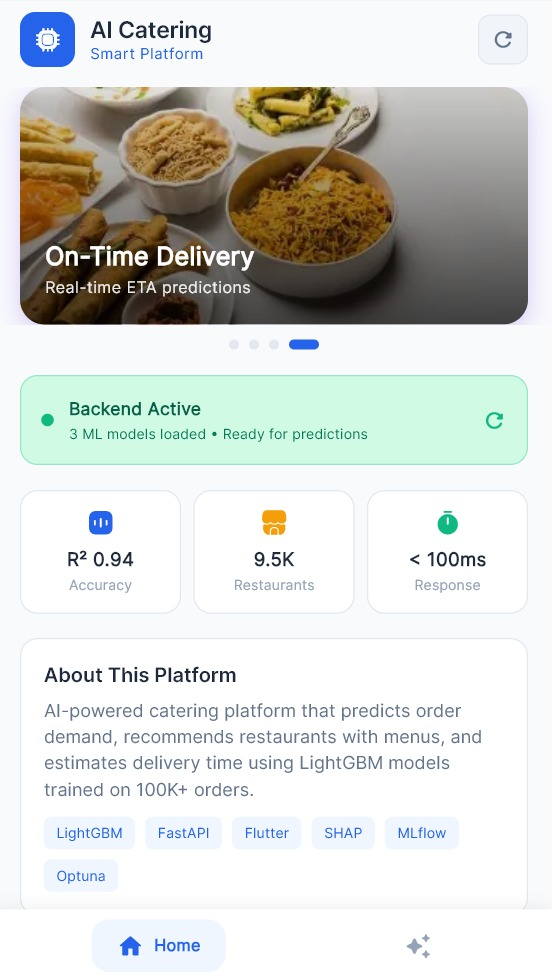
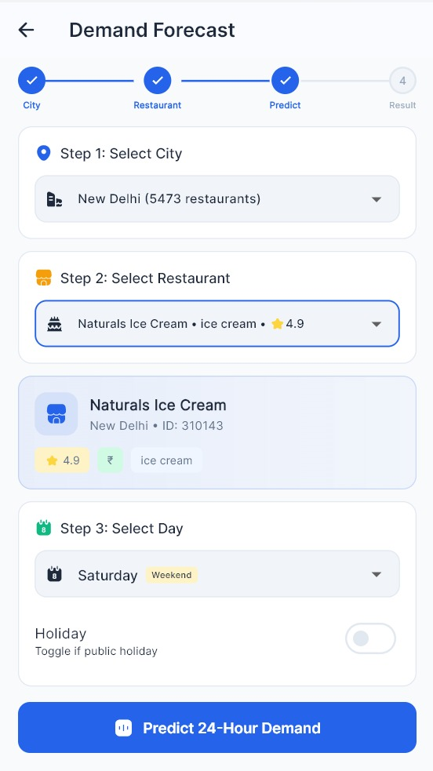
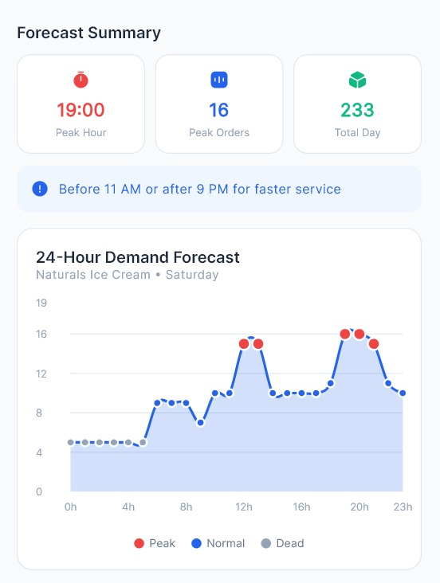
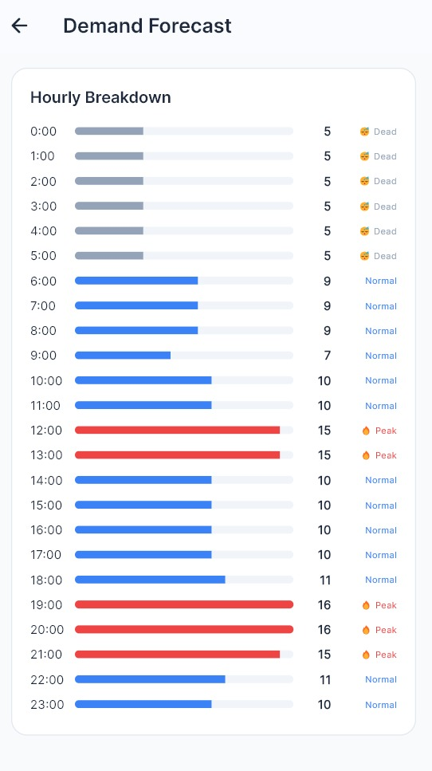
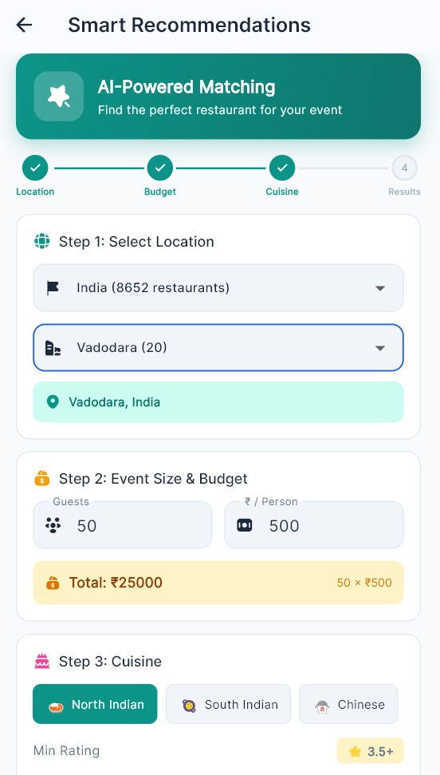
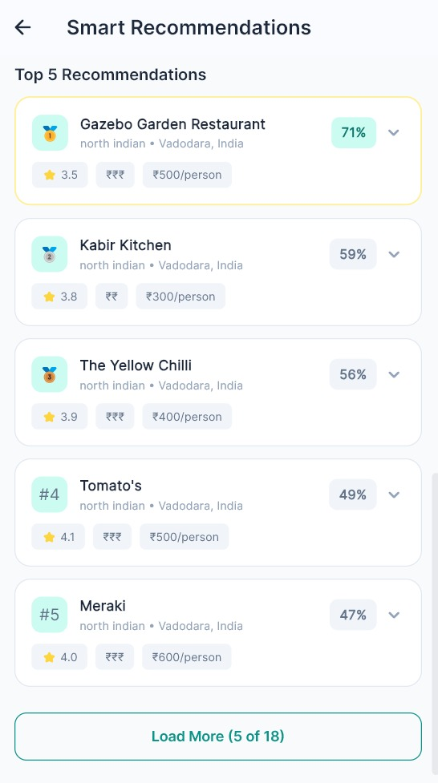
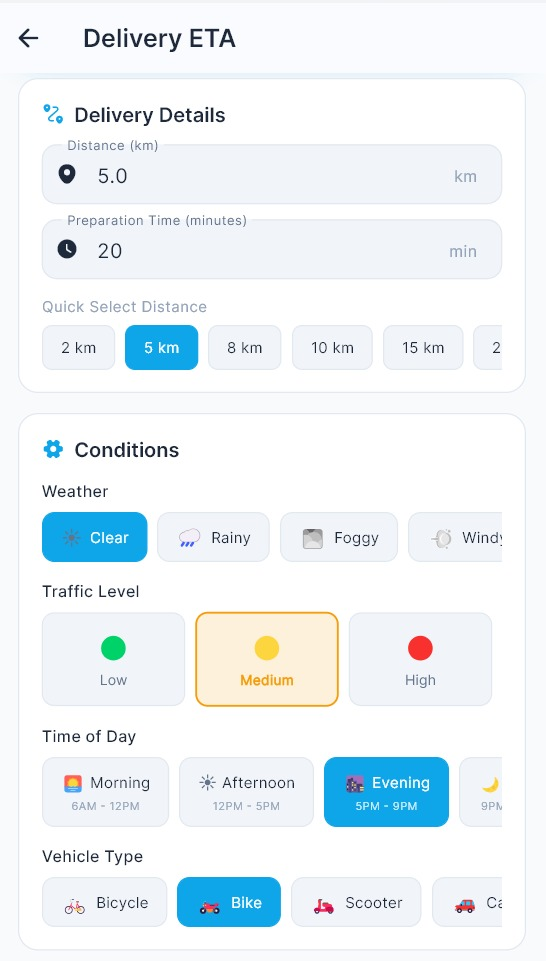
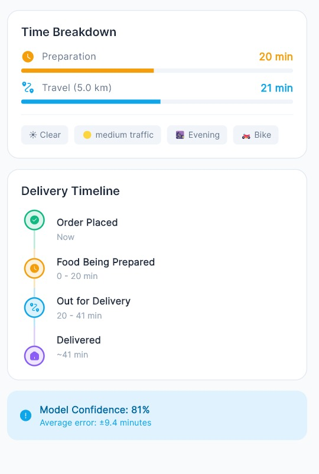

# 🍽️ AI Smart Catering Platform

<p align="center">
  
</p>

<p align="center">
  
  
  
  
  
  
  
</p>

**AI Smart Catering Platform** is a cross-platform Flutter application that helps event planners and restaurants make smarter decisions — powered by **3 production-ready AI models** trained on 100K+ real orders.

It predicts hourly order demand, estimates delivery time down to the minute, and recommends the best-matched restaurants for any event, budget, and cuisine — all through a clean, mobile-first experience with a live FastAPI backend.

<p align="center">
  
</p>

---

## 🔑 What Makes It Unique

📈 **AI Demand Forecasting** – LightGBM regression predicting 24-hour order volume per restaurant with **R² = 0.94** accuracy.

⏱️ **AI Delivery Predictor** – Real-world-aware ETA prediction factoring in distance, prep time, weather, traffic, time of day, and vehicle type, with live **model confidence scoring**.

🍛 **AI-Powered Smart Recommendations** – Hybrid content-based matching engine that ranks restaurants by cuisine, budget, party size, and rating, returning a percentage match score for every result.

⚡ **Live Backend Status** – The app surfaces real-time backend health (3 ML models loaded, sub-100ms response time) directly on the home screen, so reliability is never a guessing game.

---

## 🏗️ System Architecture

The Flutter frontend talks to a FastAPI backend that serves three independently trained models — demand forecasting, ETA prediction, and restaurant recommendation — each returning structured, explainable predictions in real time.

<p align="center">
  
</p>

### 🔄 Workflow Overview

1. **Data Ingestion & Cleaning**
   - Order history, global restaurant listings (Zomato dataset), and delivery logs are cleaned, deduplicated, and standardized.
   - Synthetic peak/weekend/holiday demand rows and augmented ETA samples fill gaps in sparse data.

2. **Model Training**
   - **Demand Model** and **ETA Model**: LightGBM regressors tuned with Optuna (30 trials each).
   - **Recommendation Engine**: TF-IDF + cosine similarity fused with a weighted rating/popularity score.

3. **Serving Layer (FastAPI)**
   - All 3 models are loaded into a live backend, exposing REST endpoints consumed by the Flutter app.
   - Backend health, model status, and response latency are surfaced directly in the app UI.

4. **Flutter Frontend**
   - Guided, step-by-step flows for each feature (City → Restaurant → Day → Predict, or Location → Budget → Cuisine → Results).
   - Results are visualized with interactive charts, hourly breakdowns, and ranked recommendation cards.

---

## ✨ Features & App Screens

### 🏠 Home
Live backend status, key model stats (accuracy, restaurant coverage, response time), and quick access to all 3 AI tools.

<p align="center">
  
</p>

---

### 📊 AI Demand Forecasting
Select a city and restaurant, choose the day (with a weekend/holiday toggle), and get a full **24-hour demand curve** — complete with peak-hour detection, hourly order breakdown, and a Peak / Normal / Dead activity label for every hour.

<p align="center">
  
  
  
</p>

**Sample output:** Peak hour 19:00 · 16 peak orders · 233 total orders/day — with a recommendation to order before 11 AM or after 9 PM for faster service.

---

### 🤖 Smart Recommendations
Set your location, guest count, budget per person, preferred cuisine, and minimum rating — the AI-powered matching engine scores and ranks every eligible restaurant.

<p align="center">
  
  
</p>

**Sample output:** 18 restaurants matched for a 50-guest, ₹500/person, North Indian event in Vadodara — top match: **Gazebo Garden Restaurant (71%)**.

---

### 🚴 AI Delivery Predictor
Enter distance and prep time, then tune real-world conditions — weather, traffic level, time of day, and vehicle type — to get an ETA with a full time breakdown and delivery timeline.

<p align="center">
  
  
</p>

**Sample output:** 5 km, medium traffic, evening, bike → **41 minutes** (20 min prep + 21 min travel), **81% model confidence**, average error ±9.4 minutes.

---

## 📊 Model Details & Results

### Model 1 — Demand Prediction (LightGBM Regression)
- Predicts hourly `order_count` per restaurant
- 12 leakage-free features (group-level averages)
- Optuna tuning (30 trials) → 262 boosting rounds
- **R² = 0.9425 | RMSE = 5.6554 | MAE = 2.2371**
- Top SHAP feature: `avg_orders_this_hour`

### Model 2 — ETA Prediction (LightGBM Regression)
- Predicts `delivery_time_min`
- 6 features: distance + encoded weather/traffic/time/vehicle
- Optuna tuning (30 trials) → 429 boosting rounds
- **R² = 0.8157 | RMSE = 9.3895 | MAE = 6.6476**
- Top SHAP feature: `distance_km`

### Model 3 — Recommendation Engine (Hybrid Content-Based)
- Recommends top restaurants based on cuisine, budget, guests & min rating
- Technique: TF-IDF (200 features) + Cosine Similarity + Popularity Score
- Final score: `0.4 × similarity + 0.3 × rating + 0.3 × popularity`
- Test relevance scores: **0.77–0.88** across North Indian, Chinese, and Italian queries

---

## 💼 Business Impact

- 🥗 Reduces food waste by **15–20%** through accurate demand prediction
- 😊 Improves customer satisfaction with precise, real-time ETAs
- 📈 Boosts orders through AI-powered, budget-aware recommendations
- 🚀 Ships as **3 lightweight, production-ready models** (5.02 MB total)

---

## 🗂️ Data Sources

| File | Description | Size |
|------|-------------|------|
| `order_history.csv` | Historical order records | 100,000 orders |
| `global_zomato_restaurants.csv` | Global restaurant metadata | 9,551 restaurants |
| `food_delivery_eta.csv` | Delivery time logs | 1,000 deliveries |

### Processed Outputs
| File | Rows |
|------|------|
| `demand_train.csv` | 112,652 |
| `eta_cleaned.csv` | 5,000 |
| `zomato_cleaned.csv` | 9,551 |

---

## 🧠 Key Techniques

- Leakage-free group-level statistical features
- Synthetic data augmentation for sparse datasets (peak/weekend/holiday logic)
- Optuna hyperparameter tuning (30 trials per model)
- SHAP-based explainability
- MLflow experiment tracking
- Joblib serialization with feature stats for production deployment

---

## 🧩 Challenges Solved

| Challenge | Solution |
|-----------|----------|
| Temporal leakage in demand features | Replaced with group-level averages |
| Small ETA dataset (1,000 rows) | Augmented to 5,000 rows with realistic noise |
| Multi-cuisine restaurant strings | Extracted a clean `primary_cuisine` field |

---

## 🛠️ Tech Stack

**Frontend (Flutter App):**
- Flutter (Dart) – cross-platform (Android, iOS, Desktop)
- Provider (state management)

**Backend (Python):**
- FastAPI – model serving
- LightGBM – demand & ETA regression
- Scikit-learn – TF-IDF, cosine similarity
- Optuna, SHAP, MLflow – tuning, explainability, tracking
- Joblib – model serialization

---

## 📁 Final Output

- ✅ 15 production-ready files
- ✅ Total model size: **5.02 MB**
- ✅ 3 independently deployable models: Demand, ETA, Recommendation

---

## 🚀 Installation & Setup

### Clone the Repository
```bash
git clone https://github.com/kunjdesai12/ai-smart-catering-platform.git
cd ai-smart-catering-platform
```

### Backend Setup
```bash
cd backend
pip install -r requirements.txt
uvicorn main:app --reload
```

### Frontend Setup
```bash
cd frontend
flutter pub get
flutter run
```
